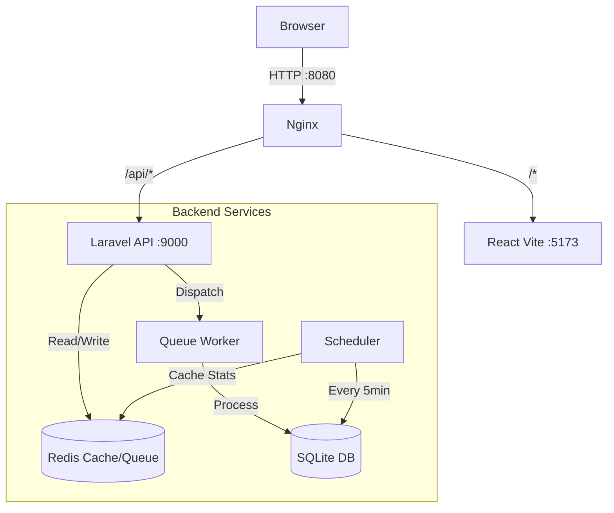

# LawnStarter - SWAPI Search Engine


## Personal Challenge: Why Laravel?
Although my recent professional work has been focused on a different backend stack, I chose to build this project with **PHP/Laravel** to demonstrate **versatility** and **engineering maturity**.

My goal was to prove that strong software principles, clean architecture and DevOps are language-agnostic. By building a robust application in a technology I haven't worked with in a while, I wanted to showcase my ability to:
*   **Adapt Components**: Integrating Laravel 12's modern features (Jobs, Pipelines) into a production workflow.
*   **Enforce Standards**: Configuring strict typing, PCOV coverage, and Docker optimization.
*   **Deliver Quality**: Ensuring the result is not just "working code," but a maintainable, high-performance system.

---

A high-performance, containerized full-stack application designed to demonstrate **Modern PHP**, **Robust Architecture**, and **Developer Experience (DX)**.

## Why This Project Stands Out

This is not just a simple API wrapper. I engineered it to handle scale, ensure data integrity, and provide a seamless developer experience.

### 1. High-Performance Architecture
Instead of blocking the user request to log statistics, I implemented **Asynchronous Queue Workers**.
*   **Zero Latency Logging**: Search queries are dispatched to a Redis Queue (`LogSearchQuery` Job) instantly.
*   **Background Processing**: A dedicated worker container processes logs without impacting the user's response time.
*   **Scheduled Aggregation**: Heavy statistical math ("Most popular hour", "Avg duration") runs every 5 minutes via the Scheduler, caching results to Redis.

### 2. Modern "Clone & Run" Experience
Onboarding a new developer takes **one command**.
*   **Infrastructure as Code**: `docker-compose` orchestrates Nginx, PHP-FPM, Node.js, and Redis.
*   **Self-Healing Setup**: The entrypoint scripts automatically handle:
    *   Dependency installation (`composer install`, `npm install`).
    *   Environment configuration (`.env` generation).
    *   Database creation (SQLite) and migrations.
*   **No "It works on my machine"**: Everything runs in isolated, pinned-version containers (PHP 8.4, Node 22).

### 3. Production-Grade Quality
*   **Type Safety**: Strictly typed TypeScript frontend and PHP 8.4 backend.
*   **Testing Culture**: 
    *   **98% Backend Coverage** (PCOV driver for speed).
    *   **95% Frontend Coverage** (Vitest with V8 provider).
    *   Tests cover Happy Paths, Edge Cases (empty states), and Integration (Jobs/Commands).

---

## Architecture

The application is unified behind an **Nginx Reverse Proxy** on port `8080`.



---

## Tech Stack

| Component | Technology | Reasoning |
| :--- | :--- | :--- |
| **Backend** | **Laravel 12 (PHP 8.4)** | Cutting-edge PHP. Use of Service Container, Jobs, and Artisan Console. |
| **Frontend** | **React 19 + Vite** | Instant HMR, lightweight build, strict TypeScript. |
| **State** | **TanStack Query** | Server-state management, caching, and loading states out-of-the-box. |
| **Styling** | **Tailwind CSS** | Utility-first, responsive, and maintainable design system. |
| **Testing** | **PCOV + Vitest** | Speed-focused testing tools for rapid feedback loops. |
| **DevOps** | **Docker Compose** | Complete isolation and reproducible environments. |

---

## Quick Start

### Prerequisites
*   Docker & Docker Compose

### 1. Launch
```bash
docker-compose up -d --build
```
> **Note**: The first run will automatically install dependencies and setup the database.
>
> To watch the progress, run:
> ```bash
> docker-compose logs -f
> ```
> Wait for `NOTICE: ready to handle connections` to appear in the server logs.

### 2. Access
*   **Web App**: [http://localhost:8080](http://localhost:8080)
*   **API**: [http://localhost:8080/api/search](http://localhost:8080/api/search)

### 3. Hard Reset (Optional)
If you ever need a fresh slate:
```bash
./reset.sh
```
*(I created this script to facilitate the validation of the "work on any machine" thing, ensuring a consistent clean slate for testing. It wipes the database, volumes, `node_modules`, and `vendor` folders.)*

---

## Testing & Coverage

I maintain high standards for code reliability.

### Backend (Laravel)
```bash
# Run Tests
docker-compose exec server php artisan test

# Generate Coverage Report (~98%)
docker-compose exec server php artisan test --coverage

# View Coverage Report
open server/coverage/index.html
```

### Frontend (React)
```bash
# Run Tests
docker-compose exec client npm run test

# Generate Coverage Report (~95%)
docker-compose exec client npm run test:coverage

# View Coverage Report
open client/coverage/index.html
```

---

## Key Features Breakdown

### Internationalization (i18n)
*   **Multi-language Support**: Full support for **English**, **Portuguese**, and **Spanish**.
*   **Implementation**: Built with `react-i18next`, featuring:
    *   **Browser Detection**: Automatically detects the user's preferred language.
    *   **Dynamic Loading**: JSON-based locale files (`locales/{en,pt,es}.ts`) for easy maintainability.
    *   **Hot Switching**: Instant language toggle from the Header flags without refreshing the page.

### Search Engine
*   **Deep Linking**: Navigate directly to `/details` from search results or related resources (e.g., clicking a Movie title in a Character's profile).
*   **Error Handling**: Gracious fallbacks for empty states or API failures.

### Statistics Engine
*   **Efficiency**: The `/api/stats` endpoint serves uncached data in **< 5ms** by reading directly from Redis.
*   **Accuracy**: A background job updates the cache every 5 minutes (configured in `routes/console.php` or `Scheduler`).

---

## Project Structure

```
├── client/              # React Application
│   ├── src/
│   │   ├── api/         # API Layer (Axios)
│   │   ├── components/  # Reusable UI (Header, ResourceLink)
│   │   ├── pages/       # Route Views (Home, Details)
│   └── Dockerfile       # Node 22 Alpine
│
├── server/              # Laravel Application
│   ├── app/
│   │   ├── Jobs/        # Async LogSearchQuery
│   │   ├── Console/     # Stats Compute Command
│   │   ├── Http/        # Controllers (Search, Stats)
│   └── Dockerfile       # PHP 8.4 + PCOV + Redis
│
├── nginx/               # Proxy Configuration
└── docker-compose.yml   # Orchestration
```
